# MIT 6.837

### Assignment0:

#### Hint:

* 依概率选择变换矩阵：

```c++
float sum(0), t(drand48());
for (int k = 0; k < num_trans; k++){
  sum += probability[k];
  if (sum > t) break;
}
do_transform[k]_to_Vec();
```

* 需要特判仿射变换后点坐标是否在图像内
* int atoi(const char *str); 将字符串数字变为int

#### Result：

* fern:

```shell
./ifs -input src/fern.txt -points 50000 -iters 30 -size 400 -output fern.tga
```

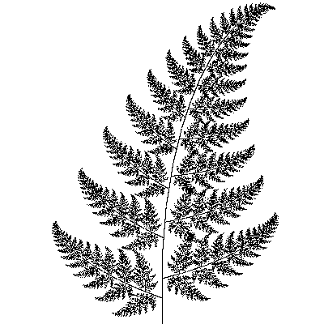

* dragon:

```shell
./ifs -input src/dragon.txt -points 50000 -iters 30 -size 400 -output dragon.tga
```


* giant X:

```shell
./ifs -input src/giant_x.txt -points 50000 -iters 30 -size 400 -output giant_x.tga
```

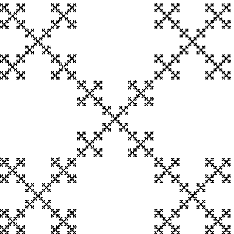

* triangle iters 30 times:

```shell
./ifs -input src/sierpinski_triangle.txt -points 10000 -iters 30 -size 200 -output sierpinski_triangle_30.tga
```


---

### Assignment1:

原理：相机从每个像素发出射线，显示最早击中物体的贴图

#### Hint:

* 在坐标运算时，最好在[0,1]标准化空间坐标进行，在遇到实际的屏幕时，可以用$x = x' * widht;\quad y = y' * height$来换算
* Image类中颜色坐标范围是[0,1]
  * 输出t在[depth_min, depth_max]之间的灰度，要在Clamp之后，作如下变换：

```c++
if (t >= depth_min && t <= depth_max){
  //离摄像机越近的物体，t越小，越应该是白色，但是白色对应1，所以应该用1减去t变换
	float grey = 1 - (t - depth_min) / (depth_max - depth_min);
  Vec3f color(grey, grey, grey);
}

```

* 隐式表示的球体求交点：

  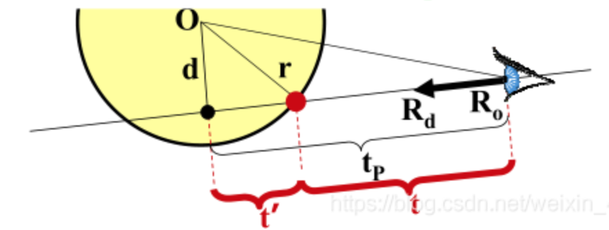

  * Ray: direction is an unit vector

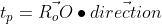

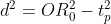

如果d比球半径要大，说明Ray与Sphere不相交，反之Ray与Sphere相交

相交在参数t时刻,射线原点在球内：

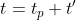

射线原点在球外：

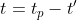

判断物体射线交点，如果得到t比hit的t小，那么同时更新t和Material

```c++
bool Sphere::intersect(const Ray &r, Hit &h, float tmin){
    Vec3f o2c = center - r.getOrigin();     //射线原点指向球心向量
    float tp = o2c.Dot3(r.getDirection());
    float o2c2 = o2c.Dot3(o2c);             //ray, sphere中心距离的平方
    float d2 = o2c2 - tp*tp;
    if (d2 > radius*radius) return false;   //不相交
    float t = sqrt(radius*radius - d2);
    
    if (tp - t < tmin){
        if (tp + t > tmin){ //射线在球内部，且相交
            if (h.getMaterial() == NULL || h.getT() > tp+t){ //如果t比h中的t小，则更新h
          		h.set(tp + t, material, r);
            }
            return true;
        } else return false;//不相交

    } else {								//射线在球外部，且相交
        if (h.getMaterial() == NULL || h.getT() > tp+t){		//如果t比h中的t小，则更新h
      		h.set(tp - t, material, r);
        }
        return true;
    }
}
```

---

* 类Group中的ObjectList应该用Object3D**类型，因为ObjectList应当是存Object3D的指针的数组，赋予ObjectList内存空间：

```c++
ObjectList = new Object3D*[n];	//Group中有n个Objects
```

* std::numeric_limits\<float\>::max 返回float最大值
* 三个向量定义相机：Up, Right, LookAt，当Up和LookAt不垂直时要修正Up:
  * Right = LookAt x Up: 通过叉乘得到Right向量
  * Up = Right x LookAt: 通过上一步得到的Right向量和LookAt向量，修正Up向量
  * 相机的三个向量需要标准化

#### Result:

```shell
./raytracer -input src/scene1_01.txt -size 200 200 -output output1_01.tga -depth 9 10 depth1_01.tga
```


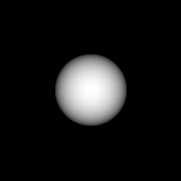

```shell
./raytracer -input src/scene1_02.txt -size 200 200 -output output1_02.tga -depth 9 10 depth1_02.tga
```

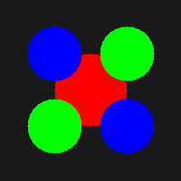

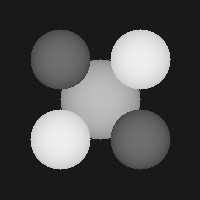

```shell
./raytracer -input src/scene1_07.txt -size 200 200 -output output1_07.tga -depth -2 2 depth1_07.tga
```


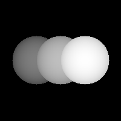

