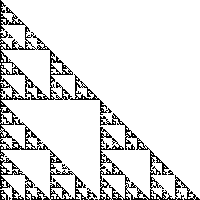

# MIT 6.837

### Assignment0:

#### Hint:

* 依概率选择变换矩阵：

```c++
float sum(0), t(drand48());
for (int k = 0; k < num_trans; k++){
  sum += probability[k];
  if (sum > t) break;
}
do_transform[k]_to_Vec();
```

* 需要特判仿射变换后点坐标是否在图像内
* int atoi(const char *str); 将字符串数字变为int

#### Result：

fern:


dragon:


giant x:


triangle iters 30 times:



### Assignment1:

#### Hint:


#### Result:

```shell
./raytracer -input src/scene1_01.txt -size 200 200 -output output1_01.tga -depth 9 10 depth1_01.tga
```


```shell
./raytracer -input src/scene1_02.txt -size 200 200 -output output1_02.tga -depth 9 10 depth1_02.tga
```


```shell
./raytracer -input src/scene1_07.txt -size 200 200 -output output1_07.tga -depth -2 2 depth1_07.tga
```


